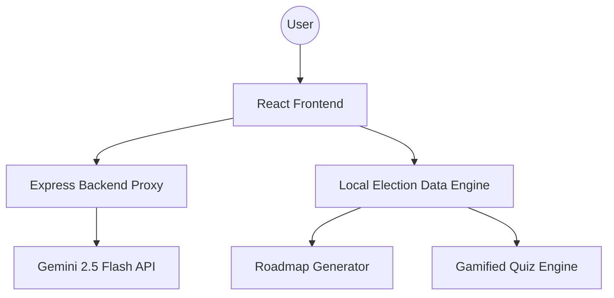

# ElectionIQ 🗳️

[](https://reactjs.org/)
[](https://nodejs.org/)
[](https://vitejs.dev/)
[](https://deepmind.google/technologies/gemini/)
[](https://example.com/challenge)

> **ElectionIQ** is a state-of-the-art AI-powered assistant designed to democratize election literacy. Built for **Prompt Wars Challenge 2**, it simplifies complex electoral processes, timelines, and legal forms into an interactive, easy-to-follow digital journey.

## 📁 Project Details
*   **Chosen Vertical:** Civic Tech / Educational Assistant
*   **Target Audience:** Indian citizens, first-time voters, and candidates.

## 🌟 The Challenge
**Prompt Wars Challenge 2 Topic:** *Create an assistant that helps users understand the election process, timelines, and steps in an interactive and easy-to-follow way.*

ElectionIQ meets this challenge by combining **Gemini 2.5 Flash** intelligence with a high-fidelity dashboard and gamified learning experiences.

---

## 🚀 Key Features

### 🤖 1. Multilingual AI Assistant
*   **Powered by Gemini 2.5 Flash**: Real-time responses to complex queries about voter rights, EVM security, and constitutional articles.
*   **Context-Aware**: Understands nuances of the Indian Election Commission (ECI) guidelines.
*   **Native Support**: Fluid conversation in English, Hindi, Marathi, Bengali, Tamil, and Telugu.
*   **Premium UX**: Modern chat interface with "thinking" animations and right-aligned conversation bubbles.

### 🗺️ 2. Interactive Election Roadmap
*   **Dynamic Guidance**: Visual step-by-step roadmaps for every major election form (Form 6, 6A, 7, 8, 2B, etc.).
*   **Requirement Tracking**: Clear checklists for eligibility, documentation, and submission steps.
*   **"First Vote" Journey**: A specialized curated path for first-time voters.

### 📊 3. Live Election Dashboard
*   **Real-Time Pulse**: Live activity monitoring with sub-second synchronization.
*   **Bot Activity Tracking**: Status monitoring for AI-driven turnout, misinformation detection, and booth management bots.
*   **Key Statistics**: Instant access to Lok Sabha seat counts, party alliances, and historical turnout data.

### 🏆 4. Gamified Learning (Quiz)
*   **Knowledge Check**: 20+ professionally curated questions on Indian democracy.
*   **Interactive Feedback**: Detailed explanations for every answer to ensure active learning.
*   **Celebration Effects**: Integrated `canvas-confetti` celebrations for high-scoring users (60%+).

---

## 🧠 Approach & Logic

### 1. Unified Information Architecture
We adopted a **"Guide-First"** logic. Instead of just providing a search bar, we structured the information into logical flows (Roadmaps) that mirror real-world election steps. The logic is handled by a local **Data Engine** (`electionData.js`) for speed and consistency, while the AI handles the "long-tail" of complex, personalized queries.

### 2. Secure AI Integration
To ensure professional-grade security, we implemented a **Backend Proxy Pattern**. The frontend never communicates directly with the Gemini API. Instead, it sends requests to our Node.js server, which:
- Sanitizes the prompt.
- Injects constitutional context.
- Securely attaches the API key.
- Handles rate-limiting and error states (like 503 high demand).

### 3. Gamified Reinforcement
The quiz logic is designed not just to test, but to **teach**. Every answer triggers an "Explanation" state, ensuring that even a wrong answer leads to a learning moment.

---

## ⚙️ How the Solution Works
1.  **Exploration**: Users land on a live dashboard that visualizes the current election "pulse".
2.  **Guidance**: Users navigate to the "Process" tab to follow validated roadmaps for voter registration or candidate nomination.
3.  **Clarification**: At any point, users can chat with the Gemini-powered assistant to clarify specific laws or procedures.
4.  **Validation**: Users finish their journey with a quiz to reinforce what they've learned, earning a digital celebration.

---

## 💡 Assumptions Made
*   **Data Accuracy**: Roadmaps and forms are based on the latest **2024 Election Commission of India (ECI)** guidelines.
*   **API Availability**: We assume users have access to a **Gemini API Key**. We've implemented high-demand error handling to manage Gemini's availability.
*   **Connectivity**: The app assumes an active internet connection for AI features, while roadmaps and quizzes are available offline for maximum accessibility.
*   **Constitutional Scope**: The current logic focuses primarily on the **Lok Sabha (General)** and **State Assembly** elections.

---

## 🛠️ Tech Stack

- **Frontend**: React 18, Vite, Vanilla CSS (Premium Glassmorphism Design)
- **Backend**: Node.js, Express (Secure API Proxy)
- **AI Engine**: Google Gemini 2.5 Flash API
- **Animations**: CSS Keyframes, Canvas Confetti
- **Testing**: Vitest for robust component verification

---

## 🏗️ Architecture



---

## 🚦 Getting Started

### 1. Clone the repository
```bash
git clone https://github.com/your-username/electionIQ.git
cd electionIQ
```

### 2. Install dependencies
```bash
npm install
cd server && npm install && cd ..
```

### 3. Environment Setup
Create a `.env` file in the root directory:
```env
GOOGLE_GEMINI_API_KEY=your_api_key_here
```

### 4. Run Development Servers
**Terminal 1 (Backend):**
```bash
npm run server
```

**Terminal 2 (Frontend):**
```bash
npm run dev
```

---

## 🛡️ Quality & Security
- **Secure API Proxying**: API keys are handled server-side to prevent client-side exposure.
- **Accessibility**: Full WCAG-compliant semantic HTML and ARIA labels.
- **Responsive Design**: Fluid layouts that adapt from mobile to 4K displays.
- **Validated Content**: All election data is cross-referenced with official ECI guidelines.

---

## 📄 License
This project is licensed under the MIT License - see the [LICENSE](LICENSE) file for details.

---

Created with ❤️ for **Prompt Wars Challenge 2**.
