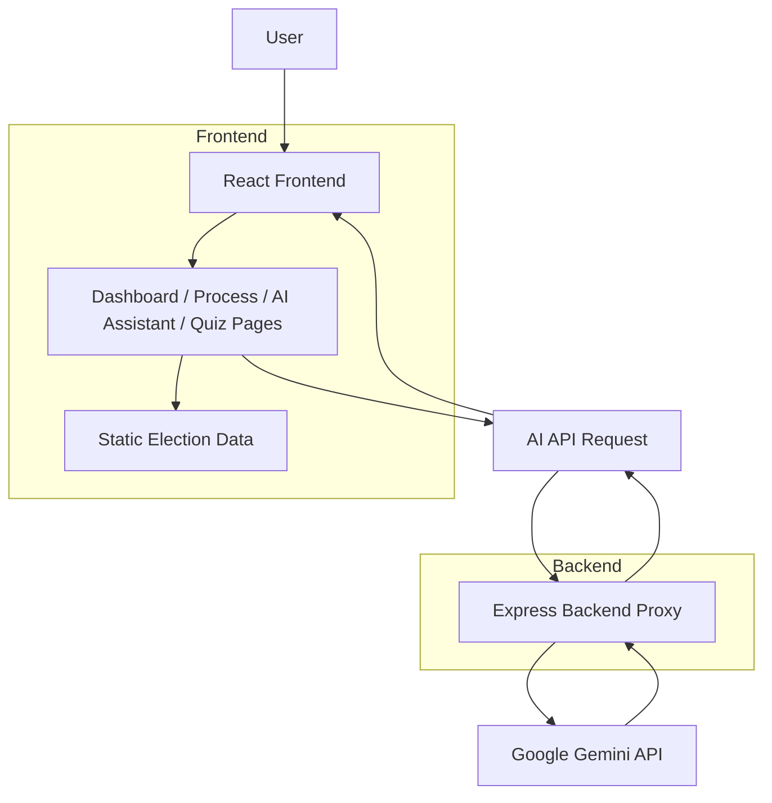

# Wireframe and Architecture

## UI Wireframe Overview

- **Header**: App title, description, and top navigation links.
- **Dashboard**: summary cards for voter metrics, vote bot status, party counts, and winning percentage bars.
- **Process**: timeline cards for each election step plus form summaries for Lok Sabha, Rajya Sabha, and state assemblies.
- **AI Assistant**: language selector, prompt input, suggestion chips, and response panel.
- **Quiz**: multiple-choice quiz with progress indicator, feedback, and final score.

## Architecture Flow

## Interaction Details

- The frontend uses React Router to navigate between pages.
- Static content such as the election roadmap, forms, and quiz questions is served from `src/data/electionData.js`.
- The AI assistant page is designed to send prompts to a backend proxy endpoint at `/api/ai`.
- The backend stores the Gemini API key securely in environment variables.
- Responses from Gemini are returned to the frontend and displayed in the assistant panel.

## Accessibility Considerations

- Use semantic HTML tags (`button`, `label`, `section`, `article`).
- Provide `aria-label` attributes for navigation and form controls.
- Ensure keyboard operability for buttons and form fields.
- Maintain readable color contrast for cards and text.
